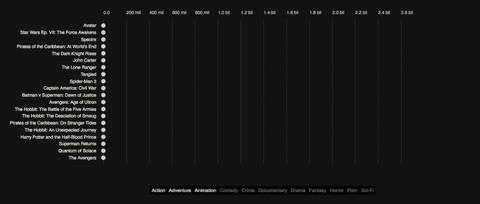

### Film money 
---

Film money is a visual story about film successes and failures. It looks at a number of Top 20 lists from the Top 20 Biggest Budgets to the Top 20 Biggest Money Losers and guides the reader through the film’s history of spending and earning money as well as gaining and not gaining approval.



Back in 2012 there has been a spree of visuals and interactives about the relationship of film budgets, revenues and ratings when [*Information is beautiful*](http://www.informationisbeautiful.net/) invited visualizers from around the planet to descend on a dataset called **‘Hollywood Stories’** showing film budgets, revenues, profits, ratings and some more metadata. Some marvelous stuff has been created (see a [list of visuals below](#a-totally-incomplete-list-of-other-film--money--rating-visuals)), but it's been a while and I thought the topic needs a data story. So here's my tuppence using a slightly different dataset comprising a wider selection of films and a different angle, focusing on one particular story: the monetary evolution from the production budget via the US revenues to the worldwide revenues and the film's ratings. Some background to [the data](#the-data), [the visual](#the-visualisation-motivation) and the [technical motivation](#the-technical-motivation)...


#### The Data

The budget and revenue figures come from [The Numbers](http://www.the-numbers.com/). The IMDb ratings come from [IMDb](http://www.imdb.com/) and the Rotten Tomatoes ratings from [Rotten Tomatoes](https://www.rottentomatoes.com/) (magic). Some individual pieces of information were fished out from Wikipedia, but especially The Number’s datasets were already in good, coherent and complete shape so that nearly no enriching was necessary. 

Maybe a few points to the Number’s dataset: I got the data on the 31st of August 2016. I might update this visual going forward and would of course update this very note, but as it stands no films after this date have been included. Further, and this is key, the data is **not** inflation adjusted. So Avatar was made in 2009 for $425 million. In 2016 dollars this would be just over $477 million. Now this has some significant effects on the comparisons and in an ideal world and in some not so distant future, there shall be an inflation adjusted version. For now, however, we need to factor this in when comparing film revenues across an extended period of time. 

Regarding the ratings, the IMDb rating is taken straight from IMDb and it is their normal rating. Every registered IMDb user can vote, however, the rating doesn't show the raw mean, but a [trimmed and weighted mean](http://www.imdb.com/help/show_leaf?votes). Although the exact methods aren’t published this shouldn’t concern but rather delight as it counteracts rigging attempts. 

The Rotten Tomato rating used is not the more famous **Tomatometer** but the **Average rating**. The Tomatometer metric is a percentage between 0 and 100%. To calculate the percentage value for a film, each critic is asked to vote a film up (fresh) or down (rotten). The number of fresh films is then divided by all votes to get a simple percentage form 0-100%. The average rating, however, is asking all critics to rate each film on a scale from 1 to 10. I took the latter as it’s a deeper metric summarizing a wider distribution. 


If you feel inclined there's more on this [here](http://www.mtv.com/news/1939097/rotten-tomatoes-youre-doing-it-wrong/) and [here](https://www.rottentomatoes.com/about/)


#### The visualisation motivation 
###### Scrollytelling and Lollipos

Telling a story with data is anything but new. The 18th and mainly the 19th century has seen the start of this with many great examples of how to use data and their visuals to tell impactful stories. [William Playfair](https://en.wikipedia.org/wiki/William_Playfair), [Florence Nightingale](https://www.theguardian.com/news/datablog/2010/aug/13/florence-nightingale-graphics) and [Charles Minard](https://en.wikipedia.org/wiki/Charles_Joseph_Minard) were fantastic data storytellers. But it required the visual being exceptional in including a visual narrative (like [Minard’s map of Napoleon’s Russia campaign](https://upload.wikimedia.org/wikipedia/commons/2/29/Minard.png)) or an exceptional narrator who could in fact tell the story to the right people to have an impact (Nightingale).

Jumping past a few generations, the advent of web technologies and increased processing powers allowed the scripting of animated charts alongside text unfolding a story on the textual as well as the data-visual level. The majority of data stories are currently being told in a marginal tool called Power Point which allows you to put charts and words together and even has some capabilities of animating charts to follow or accompany the flow of the narrative. 

However, the benefit of a data story as a web application is that we have many many more tools at hands to create a convincing merger of data, narrative and visual. We can guide readers through a story in a way they’re used to – by reading it themselves – add data to it through visuals which we don’t only juxtapose (Power Point) but interweave with the story. The reader’s experience improves and, if well told, the reader will engage more, memorize more and the narrated dataset has more chance to improve or change the reader’s understanding of the world.

Until a few years back the key technique for data storytelling on the web was the Stepper ([NY Times Budget Proposal 2013](http://www.nytimes.com/interactive/2012/02/13/us/politics/2013-budget-proposal-graphic.html), [Pathways](http://www.nationalgeographic.com/pathways/) using not just a simple button stepper but [reveal.js](http://lab.hakim.se/reveal-js/#/), an HTML/JS presentation library that is worthwile using  instead of button steppers) and in most case I would argue it’s the best way for a data story that has a few, clear – well – steps to walk through. It segments the story along clear lines and allows the reader to conceptualize these steps, and iterate through them with ease. 

Another option is the Play button, which is often used to tell a purely visual story ([Jerome Cukier's Murder visual](http://www.jeromecukier.net/projects/crime/murders.html) or - in all modesty - [bubble graphs from a dashboard design I did some time back](http://www.datamake.io/project/worldbank-scatter)). During the unfolding of a "played" story, authoring happens only on the visual level, hardly or not at all on the textual level. As such it can be impactful as the visual has all the attention, but it is limited in depth as textual narrative can offer a much richer and multi-leveled experience.

And then there’s data scrolling or scrollytelling. Scrollytelling (not sure I like the word, but for the lack of a better alternative…) links text and data through scrolling. Technically this means the reader scrolls through text and at certain points triggers the data and hence the visual to change. From a user experience point of view this means the reader does what the reader usually does on the web when reading a story: scrolling. And while the reader scrolls the data narrative unfolds alongside the textual narrative. As such it is an organic way to unfold a story online. Yet, I have always been skeptical towards scrollytelling. First of all, the UI and the temptations that come with it can be a little flimsy. It’s very easy – and tempting – for the reader to fast forward unable to find a way back to the point they got carried away from. Further, scrolling gets another task. We’re very used to scroll to show new content. But only in a single dimension. We scroll to move text forward, we scroll to move a map, we scroll to move an element out of the way. But with scrollytelling we scroll to move text *and* change other – often complex - elements on the page. So it adapts to the readers’ natural understanding of unfolding a story but adds some additional overload. 

However, there are clear cases for scrollytelling. One use-case is simply when the data story is recounted as a textual narrative, with individual story segments (sentences, paragraphs) connected in a flow. Steppers are fine in this context, but scrolling puts the textual story more in focus. Additionally, one shortfall of steppers is they only work up to a certain number of steps. The maximum number depends on the story, the dataset and the audience, but my heart would feel a little heavy whenever I encounter 31 buttons to click (sometimes 5 is already too many and in a newspaper context maybe even 3 as [Archie Tse from the New York Times reports](https://twitter.com/maartenzam/status/708259184001818625?ref_src=twsrc%5Etfw)). Scrollytelling allows for more steps as the steps are hidden and should be made forgotten when the reader is reading the story. There’s of course the size of the scroll bar indicating a story’s length, but having both the scroll-bar and 31 steps would be too intimidating for the average readers.

Also taking some advice from the Olymp of data journalism:


<sub>Malofiej 2016, Archie Tse, New York Times, [Why we are doing fewer interactives](https://github.com/archietse/malofiej-2016/blob/master/tse-malofiej-2016-slides.pdf)</sub>

So there. Those are my bipolar thoughts to scrollytelling. Looking at the chart alone, I’m pretty unipolar though:

I like lollipops. 

They are a variation of the bar chart which utilizes two of the strongest channels to encode data: position on a common scale for the circles, length on a common scale for the lines. 

In comparison to the common bar chart they elegantly focus the eye on the important piece of the element: the position of the very end or top of the bar indicating the value of the encoded variable. The line – kept lean and pure – does not more or less than what it’s supposed to do: supporting the position measure of the more important circle along the chosen axis. 

Now to add to this, lollipops are a natural choice for this particular visual story. What we’re doing here is telling a story of growth and decline (the revenues) from a certain baseline (the production budget). The lines allow us to emphasize animated growth and loss in a brain-friendly way. We can literally follow the path the money takes. The circles are the focus when the visual is static – the lines are the focus when the visual is animated. Lastly, we can easily keep the baseline in view. The baseline circles (the film’s production budget) just lose their lines and can be kept in the visual without disrupting the rest of the visual. 


#### The technical motivation
###### D3 version 4, Reusable chart pattern and Scrollytelling

The visual is no technical firework. Lollipop charts are rather predictable concoctions of visual primitives (lines and circles). But there were some technical challenges (at least for me) on mainly three other levels: 

1. [D3 version 4](https://github.com/d3/d3/blob/master/API.md),
2. the reusable chart pattern for a whole chart rather than only chart-parts 
3. and connecting text and events withit a scrolling library.

Two further challenges were to work out firstly how to integrate text elements and event triggers (like data change, chart update and the like) into the storyboard and secondly how to integrate interactivity. 

With regards to D3 V4 I was surprised how little broke when I moved the app from V3.5 to V4. I built the scaffolding in D3 V3.5, then plugged in V4 and reloaded to watch it fail. It wasn’t too bad. Some namespaces needed to be changed to the new camel-case syntax and some selection mechanics needed to be updated. I thought. But it didn’t take long and I realized that I had to dive into the ins- and outs of the newly immutable enter-selection, not automatically taking care of the updated selection. More in another blog-post soon.

The reusable chart pattern is an important building block in the ecosystem of D3 apps. It is a recipe laid out by Mike Bostock about how to best go about creating charts or chart-elements in a [factory](http://javascript.info/tutorial/factory-constructor-pattern). These factories can then be run on any elements and will just be appended in its full glory. Furthermore, we can write our own API for the factory in order to expose variables or objects used by the factory to build the chart. This way we can achieve a composable chart. 

The reusable chart pattern has been described a many times [here](https://bost.ocks.org/mike/chart/), [here](https://bocoup.com/weblog/reusability-with-d3) or [here](https://www.toptal.com/d3-js/towards-reusable-d3-js-charts), but I often learn best when I see a pattern stripped down to it’s very bare bones. I’ll write up a small extra piece on it soon, but so long, here’s the code with verbose comments to [The reusable chart pattern in pants](http://bl.ocks.org/larsvers/0ac3e1900a3ac33c43a16334e57bb774).

Building a reusable core chart in V3.5 was no problem as ample examples can be found in the wild. V4, however, provided a few challenges which cost me some hair, but made me understand the changes better. All time-consuming hair-pulling revolved around the properties of the V4 enter selection. One of them is [.merge()](https://github.com/d3/d3-selection#selection_merge) which - again - I tried to strip off all bells and whistles in the block [.merge() in pants](http://bl.ocks.org/larsvers/16d02efe0c6b0d640da9f600c81cda16). 

The third challenge was to divide the text into narrative segments and connect each segment to the respective chart actions in the most sensible manner. The structure I used integrates 3 key elements:

A story.json file holding essentially the text, and the actions – codified as numbers in an array (so we can fire one or more actions):

```JavaScript

{
	"story": [
		{
			"id": 0,
			"action": [],
			"text": "First let’s look at the big fish.<br> Up there are the 20 films with the biggest production budgets ever recorded."
		},
		{
			"id": 1,
			"action": [1],
			"text": "<span class='film' data-filmname='Avatar' id=''>Avatar</span> is already a mature guest in this list being released in 2009. But it’s earned its top spot with a whopping $425 million budget. Exactly 6 years later on the day (the 18th of December that is) <span class='film' data-filmname='Star Wars Ep. VII: The Force Awakens'>Star Wars’ The Force Awakens</span> tried hard but stays significantly behind with a mere $306 million production budget. An interesting feature for us to watch will be <span class='film' data-filmname='John Carter'>John Carter</span> (previously known as <span class='film' data-filmname='John Carter'>John Carter of Mars</span>) checking in at $280 million as the 6th biggest production so far."
		},
		{
			"id": 2,
			"action": [12,3],
			"text": "In general you might notice that all films are what one would call Action or its close friend Adventure &mdash; apart from <span class='film' data-filmname='Tangled'>Tangled</span>, the only Animation that cost the indecent sum of $260 million. <br>Play around with above genre buttons to see which films are what...<br><br>Now let’s see what they managed to get in."
		},
		{
		
		....

		}

	....


	]		
}

```


A story lookup table which reads the action of the data and triggers:


```JavaScript

// Each story item (or p/div element telling the story) gets a data-action attribute when set-up, defining the action that it triggers.
// These actions are just integers from 0 to x - an index - but stand for an event handler defined in the handler namespace.
// This hash-table associates the right handler ('action') to this action-index.

var storyLookup = {};

storyLookup[0] = function(data) { handler.pressed(undefined, 'pp_start_value'); handler.plotpoint.pp_start_value(data); };
storyLookup[1] = function(data) { handler.pressed(undefined, 'pp_production_budget'); handler.plotpoint.pp_production_budget(data); };
storyLookup[2] = function(data) { handler.pressed(undefined, 'pp_domestic_gross'); handler.plotpoint.pp_domestic_gross(data); };
storyLookup[3] = function(data) { handler.pressed(undefined, 'pp_worldwide_gross'); handler.plotpoint.pp_worldwide_gross(data); };

// .... more lookups .... //

```

And eventually the handler that composes a new chart which eventually gets rendered:

```JavaScript

var handler = (function() {

	var my = {};

	my.plotpoint = {};

	my.plotpoint.initial = function(data) {

		config.keyValue = 'biggest_budgets'
		config.varX = 'start_value';
		config.sortBy = 'production_budget'
		config.onlyYaxis = true;
		config.baseline = false;
		config.rating = false;

		var newChart = chart()
				.key(config.key)
				.keyValue(config.keyValue)
				.margin({ top: 50, right: 20, bottom: 10, left: window.innerWidth/2 })
				.varX(config.varX)
				.varY(config.varY)
				.varZ(config.varZ)
				.extentX(config.extentX)
				.extentY(config.extentY)
				.extentZ(config.extentZ)
				.sortBy(config.sortBy)
				.onlyYaxis(config.onlyYaxis)
				.baseline(config.baseline)
				.rating(config.rating);

		d3.select('div#container')
				.datum(data)
				.call(newChart);

		config.onlyYaxis = false;


		d3.select('#keyValue > .headline > p').html(hashKeyValue[config.keyValue]);
		d3.select('#sort > .headline > p').html(hashSort[config.sortBy]);
		d3.selectAll('button.rating').classed('pressed', false);

	} // no axes

	my.plotpoint.pp_start_value = function(data) {

		config.varX = 'start_value';
		config.baseline = false;

		var newChart = chart()
				.key(config.key)
				.keyValue(config.keyValue)
				.varX(config.varX)
				.varY(config.varY)
				.varZ(config.varZ)
				.extentX(config.extentX)
				.extentY(config.extentY)
				.extentZ(config.extentZ)
				.sortBy(config.sortBy)
				.onlyYaxis(config.onlyYaxis)
				.baseline(config.baseline)
				.rating(config.rating);

		d3.select('div#container')
				.datum(data)
				.call(newChart);

	} // films (pp = plotpont)

	// … more handlers … //


	return my;

})(); // handler namespace

```

In a stepper we could build this structure differently. We would be binding a handler to a button which would trigger text and action. So in a time-line of state and events we would have the 

button first &#8594; then the click &#8594; then the text and the action

In a scroll-story, we have the 

text first &#8594; then a scroll passed a certain point on the screen &#8594; triggering the action 

So the text element’s position functions as the button. 

Lastly, I looked into a number of scrolling libraries and plug-ins. I considered vanilla Javascript which would have worked just fine, I guess, but I wanted to see what libraries can offer beyond the built in events. I played around with a number of tools, like [Adam Pearce](https://twitter.com/adamrpearce)’s [graph-scroll](https://github.com/1wheel/graph-scroll) which is built with and for D3, but didn’t play nicely with V4 (my fault). Then I had a look at [ScrollMagic](https://github.com/janpaepke/ScrollMagic/tree/development#availability) and [skrollr](https://github.com/Prinzhorn/skrollr) but settled eventually for [scrollstory](https://github.com/sjwilliams/scrollstory) which seemed best documented and came recommended from Adam Pearce who used it for this [nice example here](http://www.nytimes.com/interactive/2016/08/01/us/elections/nine-percent-of-america-selected-trump-and-clinton.html?_r=0).

While it’s a jQuery plugin and hence adds a little more overhead if you like to pristinely code in vanilla flavor it has a set of properties that were nice to work with. It turns the text segments (ie. div’s or the like) into “story items” - objects that allow saving additional data. You can also bind data to the items which can be used during scrolling. I used these item-properties to pass through the actions for the handlers to read from, but it’s surely worth to read through the documentation and try.

Now one challenge I didn't and totally should have tackled was the mobile-readyness. In short: it's not. It's a desktop story. The next one will be mobile-first again...

Well, well. I’m sure there are many ways I went wrong – and even more ways I can improve the base. Always is. If you spot any, please let me know. We live to learn… 


#### A totally incomplete list of other film / money / rating visuals

* [A selection of movie visualisations, flowingdata](https://flowingdata.com/tag/movies/)

* [Film revenue streamgraph, NY Times](http://www.nytimes.com/interactive/2008/02/23/movies/20080223_REVENUE_GRAPHIC.html)

* [Budget, worldwide gross and Rotten Tomatoes score](http://krisztinaszucs.com/?my-product=hollywood)

* [Budget and worldwide gross infographic](http://www.denizcemonduygu.com/portfolio/hollywood-economics/)

* [Exploratory scatterplot for film budgets, revenues and audiences vs. ratings](http://www.informationisbeautiful.net/visualizations/the-hollywood-insider/)

* [Exploratory piece showing relations between revenues and ratings](http://acatcalledfrank.com/content/filmstrips-visualisation/index.html)

* [Rating vs Profit](http://vallandingham.me/vis/movie/)


